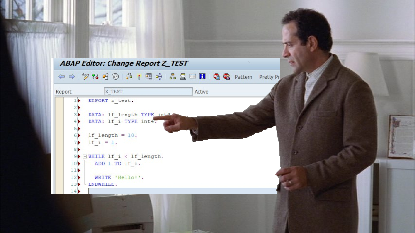

# Mr **Monk** and **ABAP**

ABAP code needs to be formatted. Otherwise it is almost impossible to catch criminal bugs killing your daily SAP processes. Mr Monk will help us in this situation.

## Using ABAPMonk in Emacs

### On Linux

In your `.emacs` file you may define the following function:

    (defun my/abapmonk-on-region ()
      (interactive)
      (shell-command-on-region (region-beginning)
                               (region-end)
                               "abapmonk.pl"
                               (current-buffer)
                               t))

You can now use the function `my/abapmonk-on-region` with <kbd>M-x</kbd> after you have marked a region.

### On Windows

It is essentially the same function as on Linux. The only difference is that you will have to swap `abapmonk.pl` with either:
* `C:/Strawberry/perl/bin/perl.exe C:/Strawberry/perl/site/bin/abapmonk.pl` if you are using Strawberry Perl
* `C:/Path/to/abapmonk.exe` if you are using the .exe file from the release section
